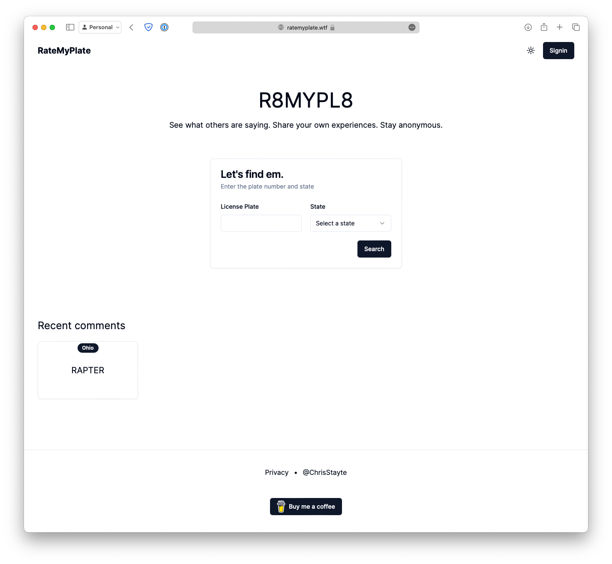
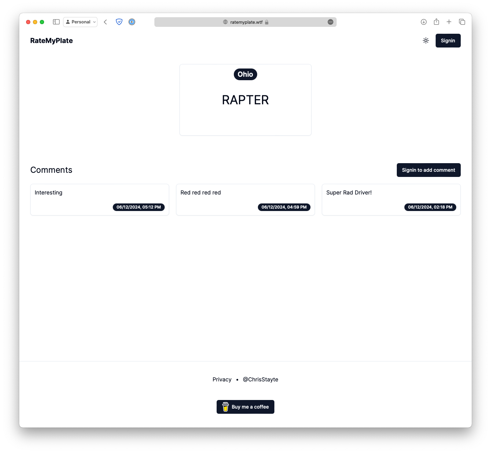

# Rate My Plate

Review and rate people based upon their driving. It's all tied to the license plate and state for each vehicle.

      
      

# Tech Stack

- Next.js 14
- Postgres
- Drizzle ORM
- Tailwind, ShadcnUI

# Custom Commands

- `npx run db:push` - drizzle push schema migration to database
- `npm run db:studio` - runs drizzle studio
- `npm run db:generate` - creates migration sql statement in `./drizzle`
- `npm run db:migrate` - applies migration sql statements
- `npm run test-production` - creates a production build and runs it

# ENV Setup

- DATABASE_URL={postgres connection string}
- AUTH_DRIZZLE_URL={postgres connection string}
- NODE_ENV={development or production}
- AUTH_SECRET={generated for auth js}
- AUTH_GITHUB_ID={authjs github id}
- AUTH_GITHUB_SECRET={authjs github secret}
- AUTH_DISCORD_ID={authjs discord id}
- AUTH_DISCORD_SECRET={authjs discord secret}
- AUTH_GOOGLE_ID={authjs google id}
- AUTH_GOOGLE_SECRET={authjs google secret}

### We diverge between dev and production

Development  

- AUTH_TRUST_HOST=true

Production  

- AUTH_TRUST_HOST=false
- AUTH_URL={https://hosteddomain.com for example}

The reason why I diverge and manually set this in production is because I don't host in vercel or cloudflare pages. These are made to auto detect said settings.
